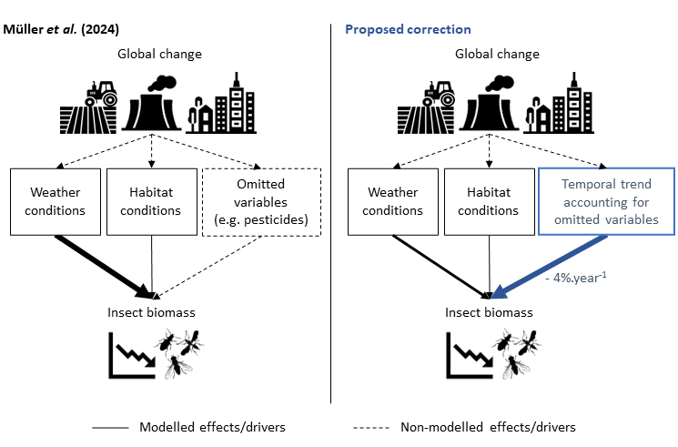

::: {#hero-heading}
**Community Ecology \| Evolutionary Ecology \| Theoretical Ecology**

I am currently a postdoc in the [Bartomeus lab](https://bartomeuslab.com/), in the Biological Station of Doñana (EBD- CSIC) in Sevilla (Spain). I am funded by [Postdoc Mobility](https://www.snf.ch/en/XIZpfY3iVS5KRRoD/funding/careers/postdoc-mobility) grant form the Swiss National Science Foundation.
:::

# News

### New paper (January 2025)

🆕 **Check out our new paper on plant-hummingbirds interactions:** <https://doi.org/10.1111/ele.70073> (also accessible [here](https://doi.org/10.1101/2024.07.04.602032))

{fig-align="center" width="362"}\
Analysing 32 plant--hummingbird communities, we found evidence for forbidden links in all of them, with a proportion varying from 3% to 29% of the possible interactions. Where they were in high proportion (\> 15%), forbidden links decreased substantially the robustness to extinctions because of constraints on interaction rewiring. Our results suggest that forbidden links are not rare in plant--hummingbird communities and have the potential to limit the rescue of species experiencing partner extinction.

### New preprint (August 2024)

🆕 **Coevolution and temporal dynamics of species interactions shape species coexistence** 🌻🐝\
<https://doi.org/10.1101/2024.08.08.607160>

### New paper (July 2024)

🆕 **Check out our commentary on the study of Müller et al. (2024):** <https://doi.org/10.1111/icad.12769> 🐝🦟🦗🐞

We proposed alternative analyses and concluded that weather conditions explain inter-annual variability, but not the long term decline, in insect biomass.\
{fig-align="center" width="477"}
