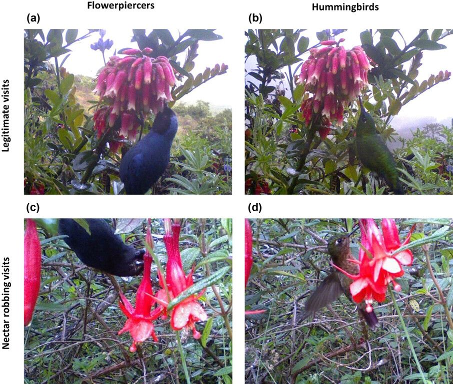

::: {#hero-heading}
**Community Ecology \| Evolutionary Ecology \| Theoretical Ecology**

I am currently a postdoc in the [Bartomeus lab](https://bartomeuslab.com/), in the Biological Station of Doñana (EBD- CSIC) in Sevilla (Spain). I am funded by [Postdoc Mobility](https://www.snf.ch/en/XIZpfY3iVS5KRRoD/funding/careers/postdoc-mobility) grant form the Swiss National Science Foundation.
:::

# News

### 🆕 Nectar robbing: what push birds to robb flowers?  

👉<https://doi.org/10.1002/oik.11552>

{width="501"}\
In tropical pollination networks, flowerpiercers are often seen as robbers and hummingbirds as legitimate pollinators but here we show that it is not so black and white. Both groups of birds pollinate flowers in a legitimate way when flower and bir dmorphologies are compatibel (bill \< corolla) and when morphologies are compatible (corolla \> bill), both groups shift to robbing, although flowerpiercers shift faster than hummingbirds.
